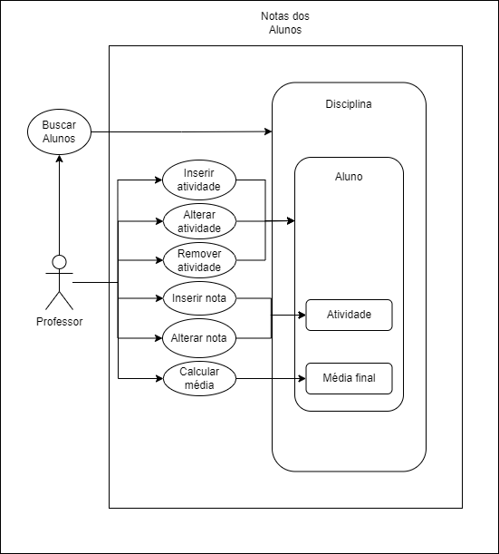

## StudentGrades
Projeto final desenvolvido para a disciplina Persistência de Dados (PDD) do curso de Pós-Graduação Lato Sensu em Desenvolvimento de Sistemas para Dispositivos Móveis do IFSP São Carlos.

### Funcionalidades do aplicativo:

